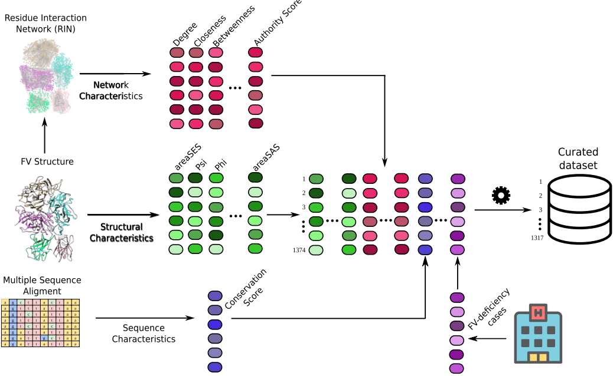
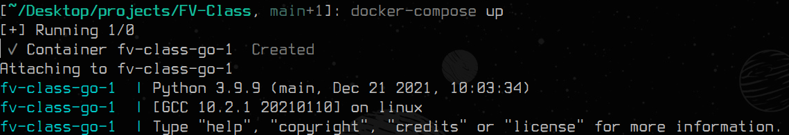
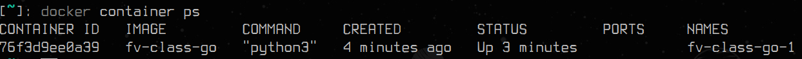
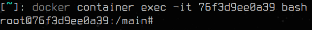

# **FV-Class**

First and foremost, thanks for you interest in using our computational framework to study FV-deficiency.

A bioinformatics and machine learning framework designed to study FV-deficiency of the **Factor V** (code: **7KVE**), although in the final paper we used a relaxed version of the structure, whose structure you can find [here](./data/7KVE_relaxed.pdb). The paper is available [here](https://doi.org/10.1038/s41598-023-36528-z).

This repository aims to show how the pipeline shown in this figure was built.

# **Setup Enviroment**

The source code provided in this repository can be executed using the environment which will be constructed with the next steps. Initially lets build a *image* based on the *Dockerfile* recipe available [here](./docker/Dockerfile). Execute the following comand in the root of the repository:
> `docker-compose build`

Then build a *container* based on the image created in the previous step. Execute the following comand in the root of the repository:
> `docker-compose up`

Example of expected result:

Before entering the container is needed to find its *id*:
> `docker container ps` 

Example of expected result:

The *id* of this container is: `76f3d9ee0a39`. To enter the container one can execute the following code:
> `docker container exec -it 76f3d9ee0a39 bash`

Example of expected result:

Obs:

1. The outputs created while inside the container stays in the container after stopped. Feel free to map a volume in the `docker-compose.yml` in order to have the files in your local machine.

2. It is also possible to customize your own local machine to execute the code. The markdown files found in supplementary info folder available [here](./supplementary/) may be usefull to you. The hardest part to configure is explained in detail [here](./supplementary/rinerator_manual_installation.md).

# **Data**

The features dataset contains structural, graph and conservation information of the pdb while the target was constructed using the clinical data as specified in the article available [here](https://www.nature.com/articles/s41598-023-36528-z).

The structural features were made using the Chimera software and the `parse_chimera_features.py` script, available [here](./src/parse_chimera_features.py). To understand input and output of this step check the supplementary information available [here](./supplementary/chimera.md).

The graph features were created using the Rinerator program with the `produce_graph_features.py` script, available [here](./src/produce_graph_features.py). To understand input and output of this step check the supplementary information available [here](./supplementary/igraph.md).

The `FV_mutations.csv` dataset available [here](./data/FV_mutations.csv) is the final version used after processing as specified in the article.

# **Cite**

> Ferreira-Martins, A.J., Castaldoni, R., Alencar, B.M. et al. Full-scale network analysis reveals properties of the FV protein structure organization. Sci Rep 13, 9546 (2023). https://doi.org/10.1038/s41598-023-36528-z

# **Contact**

André Juan Ferreira Martins:
- email: andre.jfmdm@gmail.com

Rodrigo Cabrera Castaldoni:
- email: castaldoniro@gmail.com

Tiago Jose da Silva Lopes:
- email: tiago-jose@ncchd.go.jp
